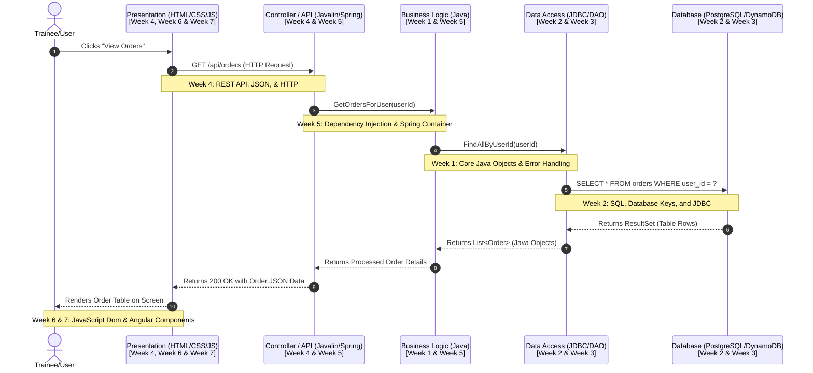

# Full-Stack Architecture: The Big Picture

## Learning Objectives
- Describe the flow of a request-response lifecycle through a modern multi-tiered full-stack architecture.
- Identify the role and responsibilities of each architectural tier (Presentation, Controller, Business Logic, Data Access, and Relational Database).
- Explain where Java, JDBC, SQL, and database storage fit in the broader software ecosystem.
- Map the weeks of the training curriculum to their respective places in the full-stack architecture.

---

## Why This Matters
When learning to code, it is easy to get lost in the syntax of a single language or the mechanics of a single framework. You spend days writing isolated Java algorithms or database queries in a terminal, but in the real world, code never exists in isolation. 

Enterprise applications are massive, interconnected systems that span multiple networks, physical servers, and software layers. If you do not understand "The Big Picture," you will struggle to debug issues that occur at the boundaries between layers (such as database connection pool failures, API serialization issues, or CORS errors on the frontend).

By understanding how a single mouse-click on a web page travels across the internet, triggers Java execution, queries a database, and returns a response, you gain the architectural context needed to design, develop, and troubleshoot full-stack applications.

---

## The Concept

A standard full-stack enterprise application is built using a **Multi-Tiered (Layered) Architecture**. Each layer has a single, specific responsibility and communicates only with the layers directly adjacent to it. This decoupling ensures that you can change one layer (e.g., swapping a MySQL database for PostgreSQL) without having to rewrite the entire application.

Let's trace these layers from the user down to the disk.

### 1. The Architectural Tiers

1.  **Presentation Layer (Frontend / Client):** The user interface. Built with HTML, CSS, and JavaScript (often using frameworks like Angular). It captures user actions (clicks, form inputs) and makes HTTP requests to the backend server.
2.  **Controller Layer (API Gateway / REST Endpoints):** The entry point to the backend. In Java, frameworks like Spring or Javalin expose REST endpoints. The controller accepts HTTP requests, extracts parameters, validates incoming data, and converts JSON data into Java objects.
3.  **Service Layer (Business Logic):** The "brain" of the application. This is where business rules, calculations, security checks, and transaction boundaries are defined. It does not know how the frontend works, nor does it know how to write database queries. It simply processes data.
4.  **Data Access Object (DAO) / Persistence Layer:** The gateway to the database. This layer abstracts the database logic away from the service layer. In Java, it uses **JDBC (Java Database Connectivity)** to execute SQL queries. It handles opening database connections, executing statements, and mapping database rows back into Java objects (Entities).
5.  **Database Layer (RDBMS):** Where the data is physically stored, structured, and queried. Relational Database Management Systems (RDBMS) like PostgreSQL or Oracle use SQL to store and retrieve data reliably, ensuring consistency and integrity.

---

## Architecture Diagram

Below is a sequence and mapping diagram showing how a client request flows through the architecture, annotated with where each week of the training program focuses.

---

## Mapping the Curriculum to the Architecture

As we progress through the training program, you can see exactly how each week builds a different part of this architecture:

-   **Week 1: Java & SCM:** Focuses on the core logic and language syntax. This forms the foundation of the **Service Layer** and developer workflow tools (Git).
-   **Week 2: RDBMS Foundations (This Week):** Bridges the Java application and the database. You will learn **SQL** (to manage the Database Layer) and **JDBC/DAO** (to build the Data Access Layer).
-   **Week 3: Cloud & NoSQL (AWS, DynamoDB, Redshift):** Explores enterprise scaling. You will move from a local database to the cloud, studying alternative database architectures (NoSQL and Data Warehousing).
-   **Week 4: Web Basics (HTML/CSS & Javalin):** Focuses on the **Presentation Layer** (HTML/CSS) and introduces the **Controller Layer** via the Javalin REST framework, teaching HTTP request-response patterns.
-   **Week 5: Spring Framework:** Explores the industry-standard framework that binds all backend layers together. You will learn Dependency Injection to manage Controllers, Services, and DAOs cleanly.
-   **Week 6: JavaScript & TypeScript:** Modernizes the presentation layer by adding dynamic behavior to web pages and preparing for compiled client-side code.
-   **Week 7: Angular Framework:** Covers building structured, complex Single Page Applications (SPAs) on the frontend.
-   **Week 8: DevOps & Docker:** Teaches how to containerize the entire stack and deploy it using automated pipelines.
-   **Week 9: Python & Final Presentations:** Integrates scripting and AI integrations into the developer toolkit.

---

## Summary
- Modern full-stack applications use a **Multi-Tiered Architecture** to separate concerns: Presentation, Controller, Service, Data Access, and Database.
- A request travels **down** from the UI through APIs and logic layers to the database, and the response travels back **up** the stack.
- Understanding this request lifecycle is critical for full-stack developers to isolate bugs and design scalable systems.
- This week's focus (Week 2) targets the **Database Layer** (via SQL) and the **Data Access Layer** (via JDBC and the DAO pattern).

---

## Additional Resources
- [Microsoft: N-Tier Architecture Style Guide](https://learn.microsoft.com/en-us/azure/architecture/guide/architecture-styles/n-tier)
- [Introduction to Client-Server Architecture](https://en.wikipedia.org/wiki/Client%E2%80%93server_model)
- [Mozilla Developer Network: Overview of HTTP](https://developer.mozilla.org/en-US/docs/Web/HTTP/Overview)
