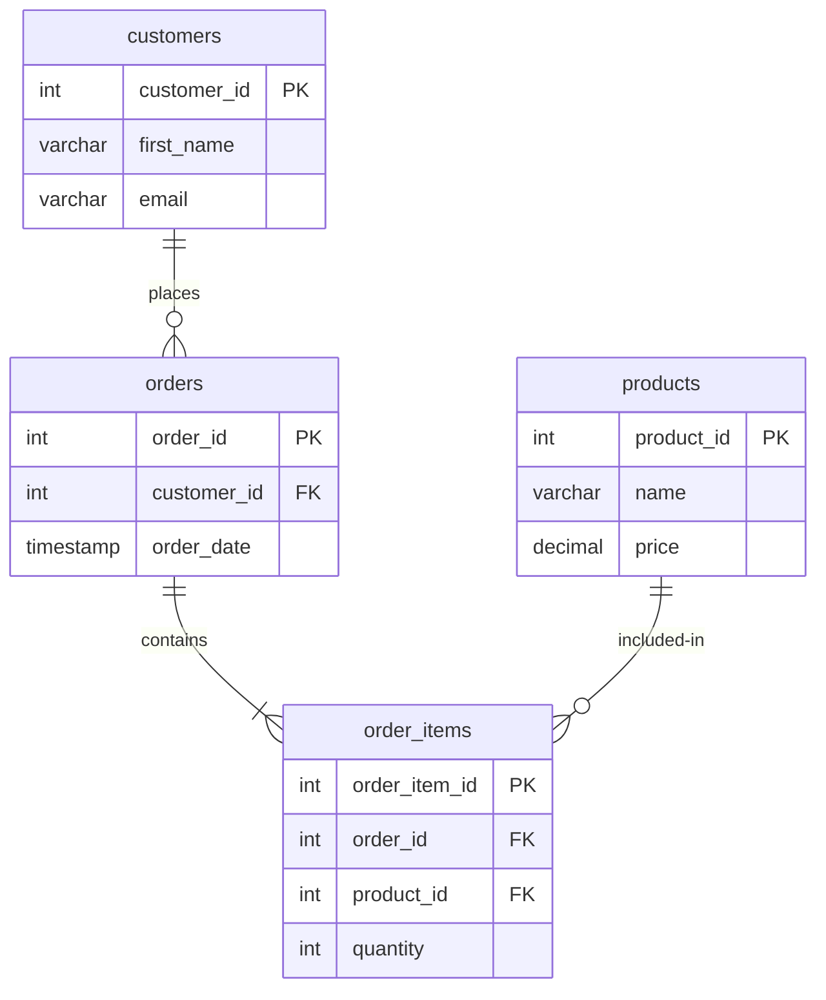

# Data Modeling and Entity-Relationship Diagrams (ERD)

## Learning Objectives
- Explain the role of data modeling in software design and database creation.
- Define Entities, Attributes, and Relationships within a relational data model.
- Identify the three main types of relational relationships (One-to-One, One-to-Many, Many-to-Many).
- Interpret cardinality notations (specifically Crow's Foot notation) on a database diagram.
- Construct relational schema patterns using junction tables to resolve Many-to-Many relationships.

---

## Why This Matters
Before building a house, an architect creates blue prints. If they skip this step and start pouring concrete immediately, the house will likely collapse. 

In database development, **Data Modeling** represents your blueprint. Many junior developers make the mistake of jumping directly into writing SQL scripts without mapping out how their tables connect. This leads to severe architectural flaws: duplicate columns, broken database constraints, and queries that are almost impossible to write cleanly.

By designing an **Entity-Relationship Diagram (ERD)** before writing code, you can identify how data fits together, enforce consistency rules up front, and build database structures that can scale with your application.

---

## The Concept

### 1. The Components of Data Modeling
Data modeling is the process of defining how data is structured and related. A model consists of three core components:
-   **Entities:** The "nouns" of your system—the objects, people, or events you want to store data about (e.g., `Customer`, `Product`, `Order`). In SQL, entities map to **Tables**.
-   **Attributes:** The "adjectives" describing the entities—the properties or details you want to record (e.g., `first_name` or `unit_price`). In SQL, attributes map to **Columns**.
-   **Relationships:** The "verbs" describing how entities connect (e.g., a customer *places* an order).

### 2. Relationship Types & Cardinality
Relationships are defined by their **cardinality**, which represents the count of instances in one entity that can relate to instances in another entity.

#### A. One-to-One (1:1)
A record in Table A is associated with exactly one record in Table B, and vice versa. 
-   *Example:* A `User` and their `UserProfile`.
-   *Implementation:* Usually merged into a single table unless separated for security or optimization.

#### B. One-to-Many (1:N)
A record in Table A can be associated with multiple records in Table B, but a record in Table B is associated with only one record in Table A.
-   *Example:* A `Customer` can place many `Orders`, but each `Order` belongs to only one `Customer`.
-   *Implementation:* The "Many" table (`Orders`) stores a reference (Foreign Key) to the "One" table (`Customer`).

#### C. Many-to-Many (M:N)
A record in Table A can be associated with multiple records in Table B, and a record in Table B can be associated with multiple records in Table A.
-   *Example:* An `Order` can contain multiple `Products`, and a `Product` can appear on multiple `Orders`.
-   *Implementation:* Relational databases cannot directly link tables this way. You must resolve a Many-to-Many relationship by creating a third table, known as a **Junction Table** (or Associative/Join Table), which contains Foreign Keys referencing both tables.

### 3. Crow's Foot Notation
In ERDs, cardinality is illustrated using lines at the ends of relationships:
-   **|| (One and only one):** Exactly one association.
-   **o| (Zero or one):** Optional single association.
-   **}+ (One or many):** Mandatory multiple association.
-   **}o (Zero or many):** Optional multiple association (the fork represents the "crow's foot").

---

## ERD Diagram Example

Here is a Mermaid diagram showing an e-commerce data model. Note the junction table `order_items` resolving the Many-to-Many relationship between `orders` and `products`.

### Analyzing the Relationships:
1.  **`customers` to `orders` (One-to-Many):** A customer can have zero or many orders (`}o`), but each order belongs to exactly one customer (`||`).
2.  **`orders` to `products` (Many-to-Many, Resolved):**
    -   An `order` contains one or many `order_items` (`|+`).
    -   A `product` is included in zero or many `order_items` (`}o`).
    -   This resolves the relationship cleanly without nesting arrays.

---

## Summary
-   **Data Modeling** is the process of mapping real-world business requirements into database schemas using Entities, Attributes, and Relationships.
-   **One-to-Many (1:N)** is the most common relational pattern, implemented via foreign keys.
-   **Many-to-Many (M:N)** relationships must be broken down using a **Junction Table** storing foreign keys from both related tables.
-   **ERDs** use visual symbols like **Crow's Foot notation** to document relationships and cardinalities.

---

## Additional Resources
-   [Introduction to ERD Notation and Diagrams](https://www.lucidchart.com/pages/ER-diagram-symbols-and-meaning)
-   [Database Modeling Fundamentals - IBM](https://www.ibm.com/docs/en/db2/11.5)
-   [Mermaid.js Entity Relationship Diagrams Guide](https://mermaid.js.org/syntax/entityRelationshipDiagram.html)
