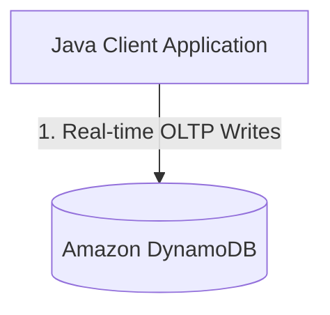

# Exercise: Cloud Data Architecture Review & Synthesis

**Exercise Mode:** Mode B: Conceptual / System Design
**Topics Covered:** Java Application Integration, DynamoDB (OLTP), Amazon S3, Amazon Redshift (OLAP)

---

## Scenario
You are a Principal Enterprise Database Architect at TechMart. Currently, the company uses:
- **DynamoDB** as the real-time operational database (OLTP) for the checkout service to record user purchases.
- **Amazon Redshift** as the centralized data warehouse (OLAP) for marketing, business intelligence, and sales analysts to run quarterly reports.

To run queries on Redshift, the transaction logs in DynamoDB must be copied over. The engineering team has proposed the following asynchronous pipeline:
1. The **Java Application Checkout Service** inserts order data into **DynamoDB** tables.
2. A nightly cron job reads logs from DynamoDB, exports them as CSV files, and uploads them to **Amazon S3**.
3. **Redshift compute nodes** execute the `COPY` command to ingest the CSV files in parallel from **Amazon S3** into Redshift reporting tables.

---

## Tasks

### Task 1: Draw the Data Flow Diagram
Using standard Mermaid syntax, draw a flowchart in the space provided below showing how data flows from the client to the final data warehouse.

Ensure your diagram highlights:
- The **Java App client** interface.
- The **OLTP boundary** (where low-latency writes occur).
- The **Staging / Storage layer** (Amazon S3).
- The **OLAP boundary** (where complex aggregations are run).

Complete the Mermaid block below:

---

### Task 2: Architectural Analysis Questions

Answer these three critical architecture questions in 2–3 paragraphs total:

**Q1: Why not run analytical business reports directly against the live DynamoDB production tables instead of exporting data to Redshift?**
*(Discuss read capacity units (RCUs), impact on customer checkout latency, and NoSQL query syntax limitations.)*

**Q2: What is the architectural role of Amazon S3 in this flow? Why copy to S3 first instead of writing a Java app that reads DynamoDB and inserts directly into Redshift row-by-row?**
*(Discuss parallel compute, network bottleneck prevention, and storage staging.)*

**Q3: Real-Time Sync Tradeoff**
The sales department wants "real-time sales data" inside Redshift instead of waiting for a nightly batch export. 
- If you synchronized DynamoDB writes directly to Redshift instantaneously, how would that impact checkout performance and cluster load?
- Suggest a middle-ground technology (e.g., DynamoDB Streams + AWS Lambda) that could capture updates and buffer them before ingestion.

---

## Deliverables
A markdown document named `architecture_synthesis_review.md` containing:
1. The completed Mermaid diagram.
2. Your answers to the three architectural analysis questions.
